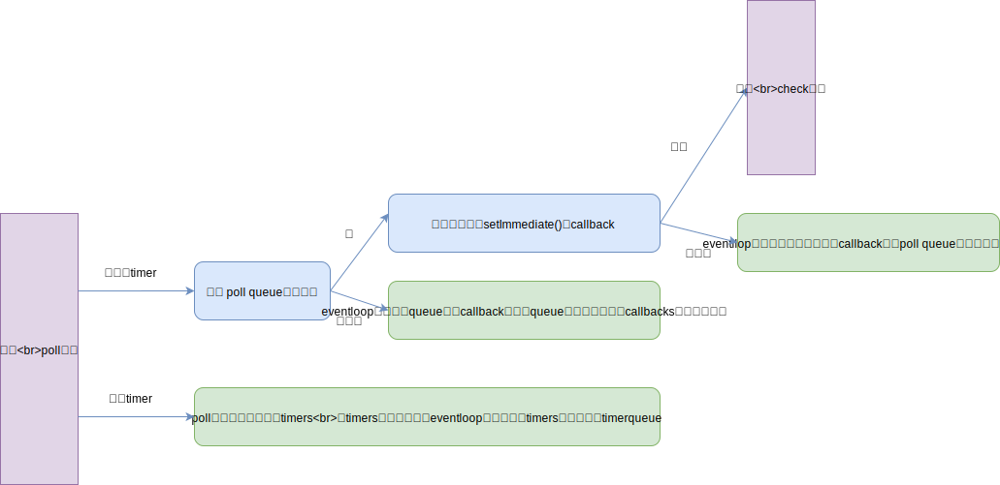

# 04-事件循环 EventLoop

## 一 JavaScript 的运行时

### 1.1 运行时特点简介

在多线程开发中，创建线程、执行线程上下文切换会产生巨大开销。多线程编程也需要应对锁、同步等问题，开发时的心智负担较大。

JavaScript 在浏览器、Node 这两个运行时中都采用了单线程异步 I/O 模型，可以避免上述缺点的同时，也能实现较大并发。当然这也带来了缺点：无法利用多核 CPU。

不过要注意的是：浏览器和 Node 这两个运行时都不是单纯的单线程环境。

浏览器内部存在很多线程，最重要的线程是： JS 解析线程、UI 绘制线程，二者不能同时运行，因为二者如果操作同一个 DOM 则会出现渲染的异常。

同样，Node 在使用单线程运行 JS 时，其内部完成 I/O 任务则是依赖一个线程池（在 Linux 中，Node 的异步是靠着 libuv 库实现的，在 Windows 中，则依赖于 IOCP 实现）。

阻塞/非阻塞，同步异步简单理解：

```txt
阻塞与非阻塞：多用于调用方。
    客户端发起请求后，客户端可以等待（阻塞），也可以不等待（非阻塞）

同步与异步：多用于被调用方。
    客户端发起请求后，服务端可以使用同步的方式返回消息，也可以使用异步的方式返回消息。

所以：如果服务端采用异步方式返回消息，客户端既可以继续一直等待（阻塞），也可以选择执行其他任务（非阻塞）。
```

### 1.2 JavaScript 单线程模型原理

由于 JavaScript 的单线程模型设计，大量的任务如果都交给这一个线程处理，势必引起整个系统的卡顿。如：假设浏览器中的：DOM 解析、事件处理、UI 绘制、JS 脚本执行等任务都由一个线程负责，处理速度是难以想象的。

假设现在有三个任务：

```txt
任务1：计算 1 + 1 的结果，假设耗时1秒
任务2：控制台打印 hello world，假设耗时2秒
任务3：向文件 demo.txt 内写入 hello world，假设耗时5秒
```

传统的思维中，单线程处理方式如下：


如果单线程只负责这些任务的调度，任务的具体执行交给其他具体的执行人，就会该线程拥有较大的自由度，如下所示，将任务 3 中的 I/O 交给磁盘自己处理：


从上图看出，任务三交给磁盘自己处理后，单线程的运行时间只需要 3 秒，极大缩短了线程的卡顿时间，但是这时候依然有问题需要处理：

- 磁盘处理完文件读写后，业务单线程如何知道读写结束？
- 线程全部任务处理完毕，运行结束，又来一个新的任务，这个线程又要重启一次（重启非常耗时）

我们可以让这个核心业务线程一直运行下去，并在任务调度时设计一个通知行为，让磁盘在完成 IO 后将结果通知给线程，这样就能完整的解决上述问题了，该调度系统我们可以简单的视为：事件循环，其解决机制如下：

- 使用死循环确保线程一直运行
- 将任务存储在队列中，线程从队列中取出进行调度
- 通过事件机制将被调度任务的处理结果通知给线程

如下所示：


线程从队列的队首中依次循环取出任务：

- 取出任务一，运算出结果
- 取出任务二，运算出结果
- 取出任务三，发现是耗时较长的 I/O，将该任务交给系统的 I/O 线程处理。

任务 3 处理如图：


总结：**事件循环的本质其实是：对 JS 脚本的调度方式。**

### 1.3 单线程模型问题

任务队列由于结构特性，必须先进先出（FIFO），可以保证任务的执行顺序不会发生变化。一般称任务队列中的任务为 **宏任务**，每完成一个任务才会从队列中取出下一个任务。

问题是：如果该宏任务比较耗时，队列也会被阻塞！我们当然想到让任务异步执行，通过事件通知方式回调即可解决这个问题，但是这样的后果是实时性变差，如果要实时监听界面中的 DOM 变化，这里就很难实现。为了权衡效率、实时性，新增了微任务。

每个宏任务中，都包含一个**微任务队列**。细粒度的任务可以加入微任务队列中，如果当前宏任务完成，引擎不会立即执行下一个宏任务，而是执行当前宏任务中的微任务。

## 二 浏览器中的事件循环

### 2.0 浏览器事件循环概念

浏览器的事件循环（event loops）主要用来协调：事件（event，如 PostMessae、MutationObserver）、用户交互（user interaction）、脚本（script）、渲染（rendering）、网络（networking）。

### 2.1 事件循环中的执行队列

异步事件对应的回调函数是在一个队列中完成执行的：

```js
console.log('aaa')

setTimeout(() => {
  console.log(111)
})

console.log('bbb')

setTimeout(() => {
  console.log(222)
})

console.log('ccc')

setTimeout(() => {
  console.log(333)
})

console.log('ddd')
```

其执行结果：

```txt
aaa
bbb
ccc
ddd
111
222
333
```

执行原理图：


注意：上述的定时器在栈中其实是直接执行了定时器本身，只有其回调函数才是等到**时间到了之后**进入回调队列！

### 2.2 宏任务与微任务

不同的任务会被分发到不同的队列中：

- 微任务（micro-task）：Promise、MutationObserve、MessageChannel
- 宏任务（macro-task）：setTimeout、setInterval、setImmediate（IE 浏览器 才拥有）、I/O

一般情况下微任务会优于宏任务执行，其具体执行规则是：先完全执行微任务队列，然后每执行一个宏任务，就会重新再去完全执行微任务队列：

```js
console.log('aaa')

// 宏任务
setTimeout(() => {
  console.log(111)
})

console.log('bbb')

// 微任务
Promise.resolve().then((data) => {
  console.log(222)
})

console.log('ccc')
```

执行结果：

```txt
aaa
bbb
ccc
222
111
```

其原理是：


那么如果二者进行了混合：

```js
console.log('aaa')

setTimeout(() => {
  console.log(222, '-t1')
  Promise.resolve().then((data) => {
    console.log(222, '-p1')
  })
})

console.log('bbb')

Promise.resolve().then((data) => {
  console.log(333, '-p2')
  setTimeout(() => {
    console.log(333, '-t2')
  })
})

console.log('ccc')
```

执行结果：

```txt
aaa
bbb
ccc
333 -p2
222 -t1
222 -p1
```

### 2.3 事件循环描述

事件循环即任务队列。在执行时，其顺序才真正决定了 JS 代码的输出结果顺序：

```txt
第一次循环：
    从 macro-task 中的script开始，全局上下文进入函数调用栈，此时如果遇到任务分发器，就会将任务放入对应队列
    调用栈清空只剩下全局上下文后，执行所有的 micro-task
    micro-task全部执行结束后，第一次循环结束

第二次循环：
    再次从 macro-task 开始执行，
    此时 macro-task中的script队列没有任务，但是可能会有其他的队列任务，而micro-task中暂时没有任务，
    此时会选择其中一个宏任务队列，如setTimeout，将改对垒中所有任务全部执行完毕，再执行此过程中可能产生的微任务
    微任务执行完毕后，再回头执行其他宏任务队列中的任务
    依次类推，直到所有宏任务队列中的任务都被执行一遍，并清空了微任务，第二次循环结束

    如果在第二次循环中，产生了新的宏任务队列，或者之前的宏任务队列中的任务暂时没有满足执行条件，例如延迟时间不够或者事件没有触发，将会继续以同样的顺序重复循环。
```

## 三 Node 中的事件循环

### 3.1 Node 中的事件循环

Node 旧版与浏览器的循环有少许不同，为了与社区同步，Node11 之后也采取了浏览器中实现的事件循环机制，即：执行完一个宏任务，去清空微任务队列，Node 中会接着执行 nextTick，这一轮完毕后，再次去执行宏任务。

在 Node11 之前，Node 的一轮 evetnloop 包含六个循环阶段

- timers（定时器）：执行由 `setTimeout()`、`setInterval()`调度的回调函数
- I/O callbacks(I/O 回调)：执行几乎所有回调函数，除了 close callbacks、timers、setImmediate()调度的回调。
- idle(空转),prepare()：Node 内部使用
- **poll（轮询）**：检索新的 I/O 事件，在恰当的时候 Node 会在该阶段阻塞
- check（检查）：调用 `setImmediate()` 回调
- close callbacks（关闭事件回调）：调用如 `socket.on('close')`等回调

poll 是最重要的阶段，进入 poll 阶段后：



### 3.2 setImmdiate()

setImmdiate 是 Node 独有的标准，不接受时间作为参数，他的事件总是在当前事件循环的结尾触发，对应的回调方法会在当前时间循环末尾（check）阶段执行，但是由于 nextTick 会在当前操作完成后立刻执行，因此总会在 setImmdiate 前执行。

```js
setImmediate(function (args) {
  console.log('executing immediate', args)
}, 'so immediate')

process.nextTick(function () {
  console.log('tick...')
})
console.log('console...')
```

依次输出：

```txt
console...
tick...
executing immediate so immediate
```

注意：node 限制了 bextTickQueue 队列的大小，如果使用很大的循环来产生该队列，则会抛出错误，而 setImmediate 不会出现该问题，因为它不会生成 call stack。

下列代码不会报错：

```js
function recurse(i, end) {
  if (i > end) {
    console.log('Done!')
  } else {
    console.log(i)
    setImmediate(recurse, i + 1, end)
  }
}

recurse(0, 9999999999)
```

下列代码报错：Maximum call stack size exceeded

```js
function recurse(i) {
  while (i < 9999) {
    process.nextTick(recurse(i++))
  }
}

recurse(0)
```

```js
/*
二者类似，但是调用时机不同，setTimeout位于timer队列，setImmediate位于check队列
*/

// 在主模块调用，会根据性能影响，执行的顺序有所不同
setTimeout(() => {
  console.log('1-setTimeout')
})

setImmediate(() => {
  console.log('2-setImmediate')
})

// 但是在IO中，是固定的.
// poll队列并不一定是在无限循环，如果有 setImmediate，会进入check，执行setImmediate,然后回到第一步从timer阶段开始重新循环
// 如果没有setImmediate，则会等待然后回到timer阶段
fs.readFile('./demo.txt', (data) => {
  setTimeout(() => {
    console.log('1-setTimeout')
  })

  setImmediate(() => {
    console.log('2-setImmediate')
  })
})
```

```js
setTimeout(() => {
  console.log('timeout1')
  process.nextTick(() => {
    console.log('nextTick1')
  })
})

setTimeout(() => {
  console.log('timeout2')
  process.nextTick(() => {
    console.log('nextTick2')
  })
})
```

### 3.3 setImmediate 与 setTimeout

setImmediate 方法会在 poll 阶段结束后执行，而 setImmediate 会在规定时间到期后执行，由于无法预测执行代码时时间循环处于哪个阶段，因此当代码中同时存在这个两个方法时，回调函数的执行顺序不是固定的：

```js
setTimeout(function () {
  console.log('setTimeout')
}, 0)
setImmediate(function () {
  console.log('setImmediate')
})
```

但是如故将二者放在一个 IO 操作的 callback 中，则永远是 setImmediate 先执行：

```js
require('fs').readFile('./foo.js', function () {
  setTimeout(function () {
    console.log('setTimeout')
  }, 0)
  setImmediate(function () {
    console.log('setImmediate')
  })
})
```

### 3.4 Node 的事件循环原理

在 Node 项目进程启动时，会创建一个类似于 `while(true)` 的死循环，每执行一次循环体的过程可以称呼为 Tick。每轮 Tick 中，都在查看是否有事件在等待处理，如果有，则取出事件，并执行器关联的回调函数，没有关联的回调函数则不执行。

查看是否有事件等待处理利用了观察者模式：每个事件循环中有一到多个观察者，只需要向观察者循环是否有要处理的事件即可。

事件循环是一个典型的生产者、消费者模型，异步 I/O、网络请求等是事件的生产者，产生的事件被传递到对应的观察者，事件循环则从观察者取出事件并处理。

Node 将事件循环分成了 6 个阶段，每个阶段都维护了一个回调函数队列，在不同的阶段，事件循环处理不同类型的事件，事件循环的阶段依次是：

- Timers:用来处理 setTimeout 和 setTimeInterval 的回调
- IO callbacks:大多数的回调方法在这个阶段执行，除了 timers、close、setImmediate 事件的回调
- idle,prepare:仅仅 Node 内部使用
- Poll:轮询，不断检查有没有新的 IO 事件，事件循环可能会在这里阻塞
- Check:处理 setImmediate 事件回调
- close.callback:处理一些 close 相关的事件，如：socket.on("close",...)

上述的处理用伪代码展示：

```js
while (true) {
  uv_run_timers()
  uv_run_pending(loop)
  uv_run_idle()
  uv_io_poll()
  uv_run_check()
  uv_run_closeing_handles()
}
```

上述代码中，每个方法代表一个阶段，假设事件循环现在进入了某阶段（即开始执行删哪个面其中一个方法），即使在这期间有其他队列中的事件就绪，也会将当前阶段队列里的全部回调方法执行完毕后，再进入到下个阶段。

### 3.5 深入理解 Node 的事件监听

在 Node 中，事件队列不止一个，定时器相关的事件和磁盘 IO 产生的事件需要不同的处理方式。如果把所有的事件都放在一个队列里，势必要增加许多类似 switch/case 的代码，还不如直接归类到不同的事件队列，然后一层层遍历。

示例：

```js
let fs = require('fs')

let startTime = Date.now()

//setTimeout 的异步
setTimeout(function () {
  let delay = Date.now() - startTime
  console.log(delay + ' 毫秒后才开始执行setTimeout回调')
}, 100)

//文件读取的异步：假设耗时95ms
fs.readFile('./foo.js', function (err, data) {
  let beginCallbackTime = Date.now()
  while (Date.now() - beginCallbackTime < 10) {
    // 使用while阻塞10ms
    console.log('阻塞中')
  }
})
```

上述代码中，存在 readfile 和 timer 两个异步操作，启动文件后，运行时开始轮询：

- 首先检查 timers，timers 对应的事件队列目前还为空，因为 100ms 后才会有事件产生
- 进入 poll 阶段，没有事件出现，代码中也没有 setImmediate 操作，事件循环便在此一直等待新的事件出现
- 直到 95ms 读取文件完毕，产生了一个事件，加入 poll 队列中，此时事件循环将该队列的事件去除，准备执行之后的 callback，readFile 的回调方法什么都没做，只是暂停了 10ms。
- 事件循环本身也被阻塞 10ms，按照通常的思维，95+10=105>100，timers 队列的事件已经就绪，应该先执行对应的回调方法才对，但是由于事件循环本身是单线程运行，因为也会被停止 10ms，如果 readFile 中出现了一个死循环，那么整个事件循环都会被阻塞，setTimeout 回调永远不会执行。
- readFile 的回调完成后，事件循环切换到了 timers 阶段，接着取出 timers 队列中的事件执行对应的回调方法

### 3.6 Node 中回调的完成

在普通开发中，回调函数一般由开发者自己调用，如：

```js
var forEach = funtion(list, cb) {
    for (var i = 0; i < list.length; i++>) {
        cb(list[i], i, list);
    }
}
```

但是在 Node 中，回调函数并不是有开发者调用。JS 发起调用后，一直到内核完成 I/O 的过程中，会产生一个名为 请求对象 的中间产物，示例：

```js
fs.open = function (path, flags, callback) {
  // ...
  binding.open(pathModule._makeLong(path), stringToFlags(flags), mode, callback)
}
```

`fs.open()`的作用是根据指定路径和参数去打开文件得到其描述符，其调用步骤是：JS 代码-->Node 核心模块-->C++内建模块-->libuv 进行系统调用。最终调用的是 libuve 内部的`_uv_fs_open()`方法，在此方法中，会创建一个 FSReqWrap 请求对象，所有 JS 代码中的参数、方法都会封装在该请求对象中，回调函数会被设置在对象的`oncomplete_sym`属性上：

```c
req_wrap->object_->Set(oncomplete_sym, callback);
```

对象包装完毕后，则会其推入线程池中等待执行。也就是说当前的 I/O 操作在线程池中开始等待，不管是否阻塞，都不会影响 JS 线程的后续执行，达到了异步目的。

线程池中 I/O 操作调用完毕后，会将获取的结果存储在 req->result 属性上，然后通过一些方法通知完成，即取出请求对象的 result 属性作为参数，取出 oncomplete_sym 属性作为方法，然后调用执行，以此达到调用 JS 中传入的回调函数的目的。

### 3.7 process.nextTick()

Node 的 nextTick() 方法，不是事件循环的一部分，只是一个异步 API，不过其回调方法是由事件循环调用的，该方法定义的回调方法被加入到名为 nextTickQueue 的队列中。在事件循环的任何阶段，如果 nextTikcQueue 不为空，都会在当前阶段操作结束后优先执行 nextTickQueue 中的回调函数，执行完该队列中的回调后，事件循环才会继续向下执行。

```js
// 宏任务
setTimeout(() => {
  console.log('1-setTimeout')
})

// 微任务
Promise.resolve().then(() => {
  console.log('2-Promise')
})

// 微任务：但是该微任务在当前执行站执行完毕后会立即调用，优于Promise.then()
process.nextTick(() => {
  console.log('3-nextTick')
})
```

注意：多个 nextTick 在一起，则会按照顺序执行，且会依次阻塞后面的 nextTick。
